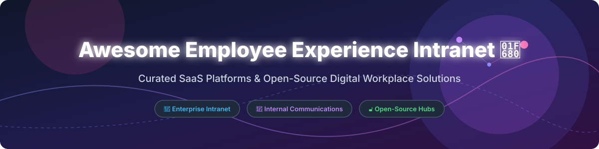

  

# 🚀 Awesome Employee Experience Intranet

  
  
  
  
  

> **A curated directory of top enterprise SaaS platforms and production-ready open-source projects for Employee Experience (EX), Digital Workplace, Internal Communications, Knowledge Management, and Frontline Employee Engagement.**

---

## 💡 Overview & Market Landscape 📈

The global employee experience intranet market is estimated at **~$8B in 2026** and projected to expand toward **~$20B by 2032**. 

### 🧩 Market Structure: Moderately Fragmented
The sector is **moderately fragmented** with no single vendor holding a winner-take-all monopoly:
- **Microsoft Viva Connections** leads enterprise distribution by bundling within Microsoft 365.
- **Simpplr** and **Unily** dominate pure-play enterprise tier digital workplace experiences.
- **Staffbase** leads frontline worker engagement and multichannel internal communication.
- Most mid-sized to enterprise organizations deploy hybrid or multi-vendor digital workplace stacks.

---

## 📖 Table of Contents 📑

- [☁️ SaaS & Hosted Platforms](#️-saas--hosted-platforms)
- [🔓 Open-Source GitHub Projects](#-open-source-github-projects)
- [🤝 How to Contribute](#-how-to-contribute)
- [☕ Support & Sponsorship](#-support--sponsorship)
- [⭐ Star History](#-star-history)
- [⚠️ Disclaimer](#️-disclaimer)

---

## ☁️ SaaS & Hosted Platforms 🏢

*Sorted in descending order by company size (valuation / revenue).*

| Platform | Description | Pricing (Starting Tier) | Free Tier / Trial Limits | Company Size (Revenue / Valuation) |
| :--- | :--- | :--- | :--- | :--- |
| **[Microsoft Viva Connections](https://www.microsoft.com/en-us/microsoft-viva/connections)** 🏢 | **Microsoft's employee experience platform.** Integrates intranet, internal communications, and knowledge hubs into Microsoft Teams and SharePoint. | **$4.00/user/month** (Viva Suite add-on) or bundled with Microsoft 365 E3/E5 plans. | **Included with active M365 subscription**; 30-day free trial available for standalone Viva Suite. | **~$281B revenue** (Microsoft FY2025) |
| **[Workvivo](https://www.workvivo.com/)** 📹 | **Employee experience & engagement platform (Zoom company).** Combines intranet news streams, social engagement, and peer recognition. | **$5.00/user/month** (Business tier, minimum seat threshold). | **14-day full feature free trial** available upon request. | **Part of Zoom (~$4.5B revenue)** |
| **[Staffbase](https://staffbase.com/)** 📱 | **AI-native employee experience platform.** Mobile-first employee app, email newsletters, and multichannel enterprise intranet. | **$4,500/year base package** (Starter package for up to 100 users). | **Free plan available for up to 20 users** with core communications features. | **~$500M+ valuation** (Private) |
| **[Firstup](https://firstup.io/)** 📣 | **Workforce communications platform.** Orchestrates targeted internal messages, automated workflows, and intranet delivery. | **$25,000/year starting contract** (Enterprise tier). | **14-day interactive sandbox trial** for enterprise comms teams. | **~$250M+ total funding raised** |
| **[Simpplr](https://www.simpplr.com/)** 🤖 | **AI-powered modern employee intranet.** Smart search, personalized news feeds, and AI employee assistant. | **$15,000/year entry contract** (Mid-market tier). | **14-day interactive guided demo trial**. | **~$100M+ ARR (Estimated)** |
| **[Unily](https://www.unily.com/)** 🌐 | **Enterprise digital workplace platform.** High-scale custom employee portals, governance, and multilingual comms. | **$30,000/year starting contract** (Small enterprise tier; large contracts $100k+/yr). | **30-day enterprise sandbox trial** upon sales qualification. | **~$100M+ annual revenue (Estimated)** |
| **[Interact Software](https://www.interactsoftware.com/)** 💬 | **Enterprise intranet software.** Focuses on employee engagement, knowledge sharing, policy management, and intranet analytics. | **$12,000/year starting tier** (Mid-market annual plan). | **14-day guided trial** available for HR & Comms managers. | **~$100M+ annual revenue (Estimated)** |
| **[LumApps](https://www.lumapps.com/)** 🎨 | **Digital workplace & employee intranet.** Seamlessly connects Google Workspace and Microsoft 365 ecosystems. | **$18,000/year starting tier** (Standard organizational tier). | **14-day trial period** for IT admins and workplace leads. | **~$100M+ total funding raised** |
| **[Haiilo](https://www.haiilo.com/)** 📣 | **Employee engagement & advocacy platform.** Merged COYO + Smarp suite offering social intranet and advocacy. | **$8,000/year starting package** (Core intranet suite). | **14-day free trial** for advocacy and intranet modules. | **~$50M+ total funding raised** |
| **[Jostle](https://www.jostle.me/)** 👥 | **Employee intranet designed to improve company culture.** Directory, news, events, and task management. | **$8.00/user/month** (Standard plan; scaled discount at higher volumes). | **14-day unlimited feature free trial** (No credit card required). | **~$10M+ annual revenue (Estimated)** |

---

## 🔓 Open-Source GitHub Projects 🛠️

*Sorted in descending order by GitHub star count.*

| Repo & Description | Star Count |
| :--- | :--- |
| **[AppFlowy](https://github.com/AppFlowy-IO/AppFlowy)** 📝 — **Open-source Notion alternative for collaborative workspaces.** Secure, privacy-first workspace for notes, wiki documentation, tasks, and project management. Built with Flutter and Rust. **AGPL-3.0**. |  |
| **[BookStack](https://github.com/BookStackApp/BookStack)** 📚 — **Opinionated, self-hosted wiki & knowledge base platform.** Simple, structured documentation platform organized in an intuitive Book → Chapter → Page hierarchy. Ideal for internal corporate intranets and IT documentation. Built with PHP & Laravel. **MIT**. |  |
| **[Wiki.js](https://github.com/requarks/wiki)** ⚡ — **Powerful and extensible open-source wiki software.** Modern Node.js intranet wiki engine with Markdown, WYSIWYG, and visual editors. Supports multi-database sync, Git backends, and built-in authentication (OAuth, LDAP, SAML). **AGPL-3.0**. |  |
| **[Plone](https://github.com/plone/plone)** 🛡️ — **Enterprise open-source Content Management System & Intranet.** Mature Python CMS featuring military-grade security, fine-grained access control, structured workflows, and Volto React frontend. Used by government agencies and large enterprise intranets. **GPL-2.0**. |  |
| **[HumHub](https://github.com/humhub/humhub)** 👥 — **The most widely adopted open-source social intranet.** Flexible social network software designed for internal corporate intranets. Features Spaces (rooms), user profiles, direct messaging, group chats, file sharing, wiki pages, calendars, and 70+ extendable modules. **AGPL-3.0**. |  |
| **[XWiki](https://github.com/xwiki/xwiki-platform)** 🧠 — **Advanced enterprise wiki & knowledge intranet platform.** Feature-rich Java-based collaborative workplace with 900+ extensions, powerful scripting capabilities, document management, and fine-grained permissions. **LGPL-2.1**. |  |
| **[eXo Platform](https://github.com/exoplatform/platform)** 🏛️ — **Full-featured open-source digital workplace.** Modern Java intranet platform with activity streams, document management, Matrix-powered chat, no-code customization, and AI chatbot integration. Serves 1M+ enterprise and government users. **LGPL-2.1**. |  |
| **[Open Intranet](https://github.com/openintranet/openintranet)** 🏢 — **Workplace intranet hub built on Drupal & Symfony.** Centralizes internal news, documents, employee directories, kudos recognition, and AI-assisted content search. Designed for organizations from 50 to 7,000+ employees. **GPL-2.0**. |  |
| **[Simoona](https://github.com/VismaLietuva/simoona)** 🎁 — **Smart social intranet & peer recognition portal.** Designed by Visma with internal wall discussions, employee profiles, and gamified Kudos peer recognition. Built on ASP.NET MVC and AngularJS. **MIT**. |  |
| **[Digital Workplace Hub](https://github.com/WRVish/digital-workplace-employee-hub)** 💼 — **Free employee portal for Microsoft 365 environments.** Offers leave management, asset tracking, travel expense approval, and ticketing built on SPFx and React. **MIT**. |  |

---

## 🤝 How to Contribute 📑

Contributions to **Awesome Employee Experience Intranet** are welcome! Help us keep this list comprehensive and up to date.

1. 🍴 **Fork** this repository.
2. 📝 **Add or edit** entries in [`README.md`](README.md) following the table formats.
3. 🔍 Provide accurate details regarding **Pricing**, **Free Tier / Trial**, **Company Scale**, or **Open-Source Licenses**.
4. 📬 Submit a **Pull Request** with a brief explanation of your additions.

---

## ☕ Support & Sponsorship ❤️

If you find this curated directory helpful for your team, organization, or research, please consider supporting the project:

- ⭐ **Star** this repository on GitHub to show your appreciation!
- 🔀 **Fork** and share it with your network or internal comms colleagues.
- 💖 **Sponsor** the developer via GitHub Sponsors: [**Sponsor ishandutta2007**](https://github.com/sponsors/ishandutta2007)

Thank you for supporting open-source software and digital workplace innovation! 🚀

---

## ⭐ Star History

---

## ⚠️ Disclaimer 📌

- This list is **community-curated** for research and evaluation purposes.
- Always consult official vendor documentation and perform compliance audits for data security (GDPR, SOC2, HIPAA) before selecting an enterprise intranet platform.
